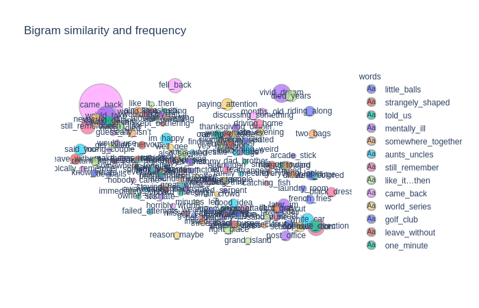

# Human-Dream-Analysis
Analysis of text in the human dreams collected from sleepanddreamsdatabase.com. It involves Topic modelling, named entity recognition, sentiment analysis of the text inthe dreams. It uses Plotly for some wonderful visualizations.

