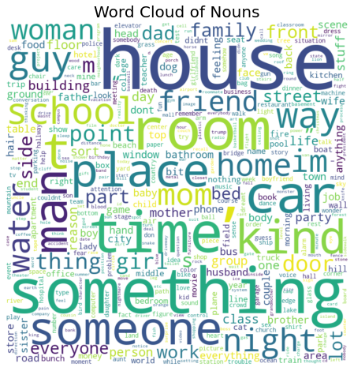
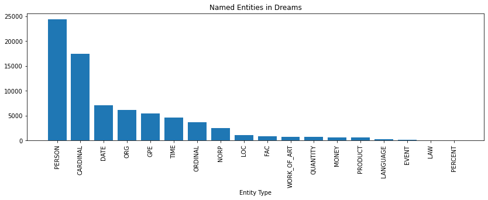
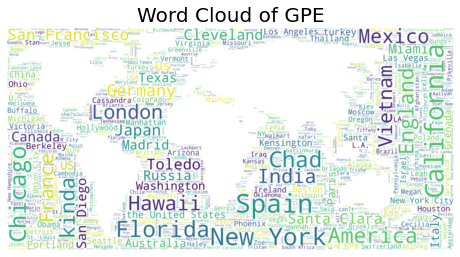
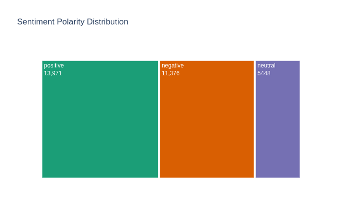
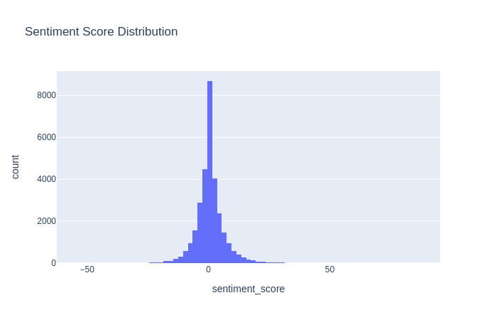
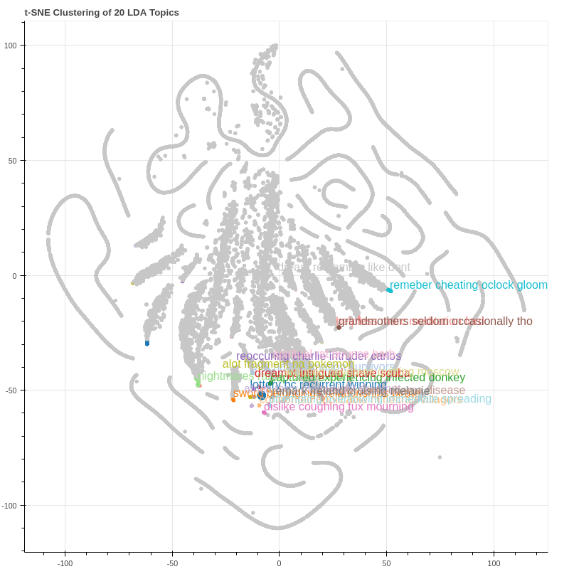

# Human-Dream-Analysis
Analysis of text in the human dreams collected from sleepanddreamsdatabase.com. It involves Topic modelling, named entity recognition, sentiment analysis of the text inthe dreams. It uses Plotly for some wonderful visualizations.

This notebook has the analysis of human dreams collected from online websites.
Let me explain my motivation!
I happened to read Freud's theories during this lockdown and got interested in his dream analysis.
I searched for dream datasets and was not able to find good structured ones. So I web scrapped and collected ~30000 dreams. More details about web scrapping is mentioned in the last section Dataset Preparation through Web Scraping.
Since there are no labelled datasets I performed unsupervised analysis of Named Entity Recognition, Sentiment Analysis and Topic Modelling.
Please share if you have know any labelled dreams datasets. Also, share your feedback in the comments section.
The notebook is organised in the following order:
* Install and Import libraries
* Data Loading and Basic Exploratoty Analysis
* Dream Analysis using POS Tagging
* Named Entity Recognition
    * Overall Distribution
    * Detailed Distribution
* Sentiment Analysis
* Topic Modelling
* Data Preparation using Web Scraping

Below are some of the visualizations:
N-Grams Exploratory Analysis:

Noun Analysis of Dreams:

Named Enties Distribution in the Dreams:

Named Entity GPE Word Cloud

Sentiment Distribution in the dreams:

Sentiment Score Distribution:

Topic Models (LDA):

